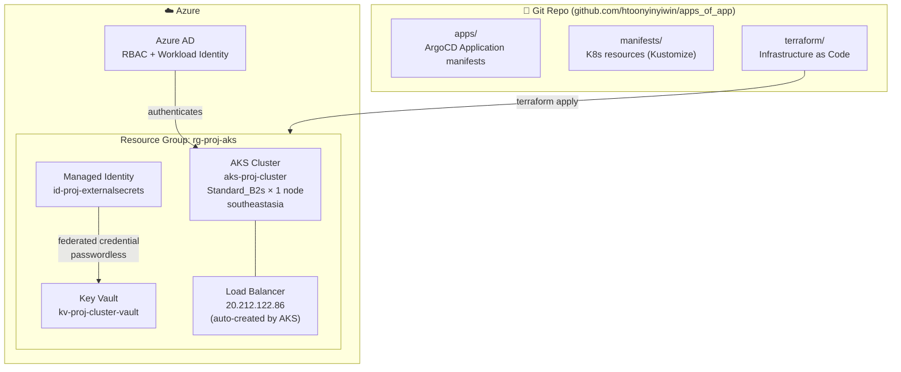
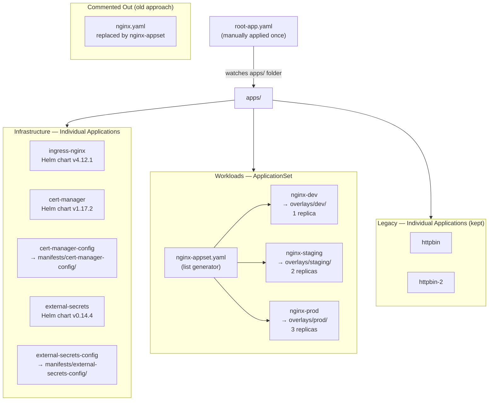
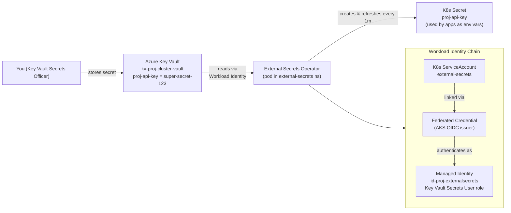
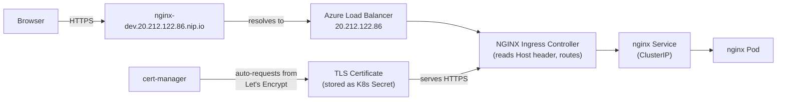

# Architecture Diagram

## 1. Overall Architecture



## 2. ArgoCD Apps-of-Apps Flow



## 3. Secrets Flow



## 4. Traffic Flow



## 5. Folder Structure

```
apps_of_app/
├── root-app.yaml                    # Bootstrap (apply once manually)
├── apps/                            # ArgoCD watches this folder
│   ├── nginx-appset.yaml            # ApplicationSet → 3 envs
│   ├── nginx.yaml                   # (commented out, old approach)
│   ├── httpbin.yaml                 # Individual app
│   ├── httpbin-2.yaml               # Individual app
│   ├── ingress-nginx.yaml           # Helm chart (infra)
│   ├── cert-manager.yaml            # Helm chart (infra)
│   ├── cert-manager-config.yaml     # → manifests/cert-manager-config/
│   ├── external-secrets.yaml        # Helm chart (infra)
│   └── external-secrets-config.yaml # → manifests/external-secrets-config/
├── manifests/
│   ├── nginx/
│   │   ├── base/                    # Shared: deployment + service
│   │   └── overlays/
│   │       ├── dev/                 # 1 replica, dev hostname
│   │       ├── staging/             # 2 replicas, staging hostname
│   │       └── prod/               # 3 replicas, prod hostname
│   ├── httpbin/                     # deployment + service
│   ├── httpbin-2/                   # deployment + service
│   ├── cert-manager-config/         # ClusterIssuer
│   └── external-secrets-config/     # SecretStore + ExternalSecret
└── terraform/                       # Azure infra (AKS, Key Vault, RBAC)
```
